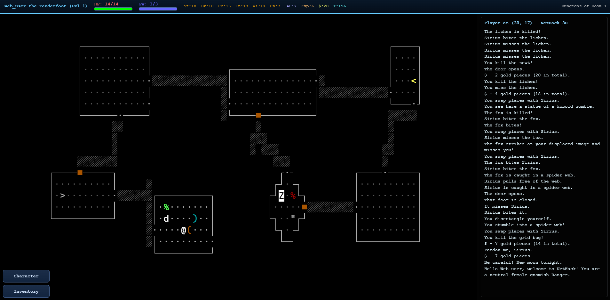
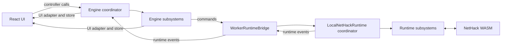

# NetHack 3D

Classic NetHack, presented as an interactive 3D dungeon. Play from above, step inside in first person, use an authentic terminal view, or explore in virtual reality on Meta Quest. The original NetHack game rules and depth are preserved.

**[Play in your browser](https://jamesiv4.github.io/nethack-3d/) · [Download the app](https://github.com/JamesIV4/nethack-3d/releases/latest)**

[Ways to play](#ways-to-play) · [Features](#features) · [Screenshots](#screenshots) · [Run locally](#run-locally)

[Privacy Policy](https://jamesiv4.github.io/nethack-3d/privacy.html)

## New in 1.6.0: The VR Update

Standalone Quest VR, up to **40% better GPU performance**, customizable hotbars, and two new tilesets headline this release. DuskHack and Geoduck join the built-in artwork, and NetHack 5 players can start without possessions in **Pauper Mode**. Greatly improved communcation between the internal NetHack builds and the 3D client, allowing for smoother, more responsive gameplay. Sounds now preload during loading, alongside improvements to inventory prompts, terrain updates, and Vulture rendering.

## Get the Game

### Windows, macOS, Android and Meta Quest

Choose your platform's package from the [Releases page](https://github.com/JamesIV4/nethack-3d/releases/latest). Windows builds include an x64 installer and portable app; the legacy 32-bit portable package is no longer produced. Android and Quest have separate APKs: choose `NetHack 3D <version> Quest.apk` for standalone VR.

The Quest APK bundles the game and its VR host for offline play, without a PC, remote game server, or separate browser installation. Sideload it using your usual Quest installation workflow.

Note: The macOS desktop build is packaged as an unsigned DMG from GitHub Actions.
On first launch, macOS may ask you to right-click the app and choose `Open`.

### iPhone and iPad

On iPhone/iPad, open the play link in Safari, tap the Share button, then tap `Add to Home Screen`.
Launch it from your Home Screen for a web app fullscreen experience.

### Steam Deck (SteamOS) / Linux AppImage

1. [Download the latest Linux release](https://github.com/JamesIV4/nethack-3d/releases/latest) from the Releases page in Desktop mode.
2. Add the AppImage directly to Steam using "Add Non-Steam Game to My Library".
3. Keep Steam compatibility/proton disabled for this native Linux launch path.
4. Linux launch option notes:
   - `--windowed`: launch in a normal framed window instead of fullscreen.
   - `--borderless`: launch in a frameless non-fullscreen window that covers the display without using native fullscreen mode.
5. Recommended Steam Input profile tweak: Set left trackpad to Left Joystick, and trackpad click to the A button. Movement and common actions are very simple this way!

## Ways to Play

| View                  | Experience                                                                                                      |
| --------------------- | --------------------------------------------------------------------------------------------------------------- |
| Overhead 3D           | Survey the dungeon, pan and rotate the camera, and zoom from individual tiles to a whole-level overview.        |
| First person          | Explore from inside the dungeon with mouse, touch, or controller input.                                         |
| Terminal              | Play in a crisp, zoomable grid with the active game's native characters, colors, symbol sets, and highlighting. |
| Quest tabletop VR     | View the dungeon as a board you can move, tilt, scale, and pan with tracked controllers.                        |
| Quest first-person VR | Step into a room-scale dungeon with tracked controllers, snap turning, and adjustable world scale.              |

### A Complete VR Interface

Use tracked controllers to move, run, search, select tiles, and open context actions. Inventory, messages, status, minimap, menus, and prompts appear on floating panels you can reposition. A movable virtual keyboard handles names and text entry, while a collapsible hotbar keeps your chosen commands close by.

Adjust tabletop area and tilt, first-person world scale, render resolution, and instant or animated movement. Recenter through the game or headset controls. Animated controller models and equipped-weapon visuals bring your hands into first-person play; the app also restores immersive mode after an interruption.

### Graphics to Suit Your Game

Use graphical tiles, 3D ASCII, or Vulture artwork in the overhead and first-person 3D views. Vulture brings its isometric artwork into a full 3D scene; ASCII offers NetHack 3D, Classic, and Terminal color schemes. Terminal mode has its own message-log gutter.

## Features

### Authentic NetHack, Your Choice of Variant

Choose **NetHack 5.0**, **NetHack 3.6.7**, or **Slash'Em**, with separate saves for each. Create a character or roll a random hero, save your character preferences, and resume long-running adventures. Configure startup options such as autopickup, pet names, and native highlighting, plus variant-specific choices including Explore Mode and NetHack 5's tutorial and Pauper Mode.

### Controls That Fit Your Setup

- **Keyboard and mouse:** classic commands, extended-command autocomplete, clickable dungeon targets, and inventory context actions.
- **Controller:** radial action menus and movement confirmation for careful navigation from the couch.
- **Touch:** tap/swipe movement, quick actions, a mobile message log, and first-person look/run gestures.
- **Custom hotbars:** independently configure desktop, mobile/VR, and Menu / Actions layouts in **Options → Hotbar**. Search commands, add or remove buttons, reorder them, or restore defaults. Layouts save immediately.

### Artwork and Custom Tilesets

Built-in choices include **Vulture, Absurdly Evil, DawnHack, DuskHack, Geoduck, NetHack Modern, Nevanda, PixelHack, RZTiles, and Vanilla NetHack Tiles**.

Import and manage your own tilesets with built-in background removal. Rectangular tiles keep their proportions, including Geoduck's automatically detected 15×25 artwork. Set a custom tile height during import, or turn off **Match blocks to tile aspect ratio** in Display options to retain square dungeon cells.

### Information at a Glance

Track health, power, attributes, armor, gold, hunger, experience, time, and dungeon location in the HUD. A scalable minimap offers alternate color schemes and drag-to-center navigation. Live messages, inventory categories, keyboard hints, item quantities, and multi-pickup selection make common tasks accessible without memorizing every command.

Native pet, item-pile, and standout highlighting are supported, including overhead heart markers for pets. Optional floating damage, healing, stat, and experience indicators provide immediate feedback.

### Sound, Lighting and Combat Effects

Dynamic lighting surrounds the player, while defeated monsters can shatter into pieces with blood mist and ground splatter. Customize the effects and movement animation to your taste. Sound effects accompany exploration and combat, and you can create and edit your own sound packs directly in the game.

## Gameplay Video

## Screenshots

<table>
  <tr>
    <th>Combat in the Gnomish Mines</th>
    <th>Shatter monsters into pieces!</th>
  </tr>
  <tr>
    <td></td>
    <td></td>
  </tr>
  <tr>
    <th>Multiple tile sets</th>
    <th>Beautiful UI</th>
  </tr>
  <tr>
    <td></td>
    <td></td>
  </tr>
  <tr>
    <td colspan="2"></td>
  </tr>
</table>

## Run Locally

1. `npm i`
2. `npm run dev`
3. Open `http://localhost:5173/`

### Quest Development

The [Quest WebXR build and development guide](docs/quest-webxr-runtime.md) covers prerequisites, controller mappings, signing, and device checks. Run `npm run quest:webxr:wired` to test with Quest Link. For a standalone debug APK, install the documented Android/JDK tools, run `npm ci`, then `npm run quest:webxr:apk -- --debug`. The build downloads and verifies its pinned Meta SDK and patched GeckoView dependencies; no Firefox source build or private signing key is needed.

The earlier [Quest UI prototype](docs/quest-vr-plan.md), [stereo experiment](docs/quest-stereo-vr.md), and [legacy wired preview](docs/quest-wired-development.md) remain available for reference. Use the WebXR workflow above for the current VR implementation.

## Scripts

### Development and Checks

- `npm run dev` - Start Vite dev server.
- `npm run check:tsc` - Check TypeScript and subsystem contracts without building.
- `npm test` - Run regression tests, including engine input, world state, and rendering resources.
- `npm run build` - Build production bundles.
- `npm run build:electron` - Build bundles with Electron-safe relative asset paths.
- `npm run ensure:rollup-native` - Manually repair a missing Rollup native optional dependency on the build machine. Normal build/dev commands rely on the dependencies installed by npm and do not run this repair check.
- `npm run preview` - Preview production build locally.

### Desktop Packages

- `npm run electron:dev` - Run Electron against the Vite dev server.
- `npm run electron:pack:mac` - Build an unpacked macOS app bundle to `release/` for local testing.
- `npm run electron:dist:mac` - Build a macOS DMG to `release/` (pass `-- --universal` to produce a universal macOS build).
- `npm run electron:dist:win` - Build and package a Windows NSIS `.exe` installer (x64) to `release/`.
- `npm run electron:dist:win:portable` - Build and package a portable Windows `.exe` for x64 to `release/`.
- `npm run electron:dist:linux:appimage` - Build and package a Linux AppImage (x64) to `release/` (uses WSL automatically on Windows, stages Linux runtime deps, and includes Linux icon assets).
- `npm run electron:dist:all` - Build Electron assets once, then package the Windows x64 setup and portable executables, and Linux AppImage back to back.
- `npm run electron:dist:all:parallel` - Same as above, but packages Windows and Linux at the same time after the shared Electron build.

On Windows, AppImage packaging builds the web assets with Windows Node, then syncs the packaging inputs to `~/.cache/nethack3d/appimage/<checkout-id>/` inside WSL. Linux dependencies and packaging intermediates stay there; only finished artifacts and build diagnostics are copied back to `release/`. WSL needs Linux Node/npm, `rsync`, and `libcups.so.2`. The first run installs dependencies; subsequent runs reuse them until package metadata, `.npmrc`, or the Linux Node version changes. Each stage prints its elapsed time.

Set `NH3D_SKIP_ELECTRON_BUILD=1` only when `dist/` already contains a current Electron build. `NH3D_ELECTRON_OUTPUT_DIR` changes the Windows artifact destination. The combined release scripts retain their shared-build and parallel packaging behavior. `NH3D_APPIMAGE_PREPARE_ONLY=1` stages the current build and dependencies; `NH3D_APPIMAGE_SKIP_PREPARE=1` packages that existing staged snapshot. An interrupted process may leave a workspace `lock` directory; remove that empty directory only after confirming no AppImage build is running.

### Android and Quest Packages

- `npm run android:add` - Create the native Android project with Capacitor (run once).
- `npm run android:sync` - Build web assets and sync them into the Android project.
- `npm run android:release` - Build web assets, sync Android, and create a signed release APK without opening Android Studio. Output: `release/NetHack 3D <version> Android.apk`.
- `npm run quest:webxr:setup` - Download and verify the pinned Quest runtime dependencies, or restore them from the external cache.
- `npm run quest:webxr:apk -- --debug` - Build and verify a standalone Quest debug APK using the generated Android debug key. Omit `--debug` for a signed release using your own signing configuration; each signed build automatically increments its Meta upload version code while keeping the `package.json` display version. The stable output is `quest/build/outputs/apk/nethack3d-vr.apk`, with a versioned copy under `release/`; `quest:webxr:publish-apk` verifies and copies an existing build without incrementing it. See [version counter and machine-transfer instructions](docs/quest-webxr-runtime.md#automatic-upload-version-codes).
- `npm run quest:apk` - Build the legacy Quest app and copy it to `release/NetHack 3D <version> Quest Legacy.apk`.
- `npm run android:open` - Open the Android project in Android Studio.
- `npm run android:sync` followed by `npx cap run android` - Build and sync web assets, then run on a connected Android device/emulator.

### Game Data Updates

- `npm run glyphs:generate` - Regenerate glyph catalog from runtime artifacts.
- `npm run glyphs:check` - Verify checked-in glyph catalog is up to date.

### Android release signing

Once, copy `android/keystore.properties.example` to `android/keystore.properties` and fill in your existing release keystore path, alias, and passwords. Use the same key used for previous releases so installed apps can be updated. The local properties file and `.jks`/`.keystore` files are ignored by Git. Use forward slashes for Windows paths; relative keystore paths resolve from `android/`.

Then run `npm run android:release`. Java and the Android SDK must be installed; the script detects Android Studio's bundled Java and default SDK without opening the IDE. `npm run android:release -- --check` checks prerequisites and the signing configuration without building (passwords are checked during signing). For automation, `NH3D_ANDROID_STORE_FILE`, `NH3D_ANDROID_STORE_PASSWORD`, `NH3D_ANDROID_KEY_ALIAS`, and `NH3D_ANDROID_KEY_PASSWORD` override the corresponding properties.

## Architecture

[src/main.tsx](src/main.tsx) mounts [App.tsx](src/ui/App.tsx). The [React UI feature modules](src/ui/README.md) own startup, dialogs, client options and interaction state; the app composition wires them to the engine and UI adapter. [Nethack3DEngine.ts](src/game/Nethack3DEngine.ts) coordinates startup, runtime events, frame updates, options, and disposal, and preserves the public controller API used by the UI.

Rendering, input, camera, world presentation, menus, audio, and diagnostics live in focused classes under [src/game/engine/](src/game/engine/README.md). Each subsystem owns its state and declares the specific members it uses from neighboring systems. NetHack's authoritative game state and rules continue to run in WASM inside the worker.

[LocalNetHackRuntime.ts](src/runtime/LocalNetHackRuntime.ts) coordinates the worker-facing API, callback dispatch, startup and shutdown. Its [runtime subsystems](src/runtime/local/README.md) own input waits, menus, map and status caches, callback decoding, and persistence, with explicit dependencies assembled before WASM starts.

| Area                                                  | Entry point                                                                                                                            |
| ----------------------------------------------------- | -------------------------------------------------------------------------------------------------------------------------------------- |
| Engine composition and dependencies                   | [create-engine-systems.ts](src/game/engine/create-engine-systems.ts)                                                                   |
| Rendering and visual effects                          | [rendering/](src/game/engine/rendering/), [effects/](src/game/engine/effects/)                                                         |
| Commands, devices, and camera                         | [input/](src/game/engine/input/), [camera/](src/game/engine/camera/)                                                                   |
| Terrain caches, tile updates, and entity movement     | [world/](src/game/engine/world/)                                                                                                       |
| Menus, minimap, and status presentation               | [ui/](src/game/engine/ui/)                                                                                                             |
| Sound, haptics, and developer panels                  | [audio/](src/game/engine/audio/), [diagnostics/](src/game/engine/diagnostics/)                                                         |
| React state bridge                                    | [engineUiAdapter.ts](src/state/engineUiAdapter.ts), [gameStore.ts](src/state/gameStore.ts)                                             |
| Worker transport and host                             | [WorkerRuntimeBridge.ts](src/runtime/WorkerRuntimeBridge.ts), [runtime-worker.ts](src/runtime/runtime-worker.ts)                       |
| Runtime API and subsystem assembly                    | [LocalNetHackRuntime.ts](src/runtime/LocalNetHackRuntime.ts), [create-runtime-systems.ts](src/runtime/local/create-runtime-systems.ts) |
| NetHack callbacks, input waits, state and persistence | [Runtime ownership guide](src/runtime/local/README.md), [RuntimeInputBroker.ts](src/runtime/input/RuntimeInputBroker.ts)               |
| Glyph classification and fallback catalogs            | [glyphs/](src/game/glyphs/)                                                                                                            |
| Browser debug helpers                                 | [app.ts](src/app.ts)                                                                                                                   |

For task-to-file maps and ownership rules, start with the [engine guide](src/game/engine/README.md), [runtime guide](src/runtime/local/README.md), and [React UI guide](src/ui/README.md). The [world/runtime flow guide](docs/engine-world-runtime.md) covers map updates, under-player items, level transitions, and movement. Contributor and agent references include the [project structure](.agents/rules/project-structure.md), [code hotspots](.agents/rules/logic-hotspots.md), [movement and input flow](.agents/rules/movement-flow.md), and [WASM pointer troubleshooting](docs/pointer-abi-troubleshooting.md).

## Credits

- NetHack 3.6.7 to 5.0 tile-order translation logic is adapted from [`horlogeislux/tileto370`](https://github.com/horlogeislux/tileto370) (MIT License).

## GitHub Pages Deploy

1. Push this repo to GitHub.
2. In repository settings, go to `Settings > Pages`.
3. Set `Source` to `GitHub Actions`.
4. Ensure your deploy branch matches `.github/workflows/deploy-gh-pages.yml` (`main` by default).
5. Push to `main` (or run the workflow manually).

The workflow builds with Vite and deploys the `dist/` folder.

## GitHub Actions Desktop Builds

- `.github/workflows/build-macos-electron.yml` builds the macOS Electron app on `macos-latest`.
- Manual runs upload the generated DMG as a workflow artifact and will also publish it when a matching release tag already exists.
- Tag pushes like `1.2.2` also upload the macOS DMG to the matching GitHub Release.
