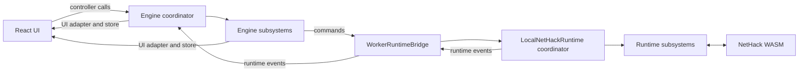

# NetHack 3D

Quest VR development: the [direct Three.js WebXR runtime proof](docs/quest-webxr-runtime.md) uses the original game renderer with a floating HTML UI. Run `npm.cmd run quest:webxr:wired` to test with Quest Link; the standalone host has additional runtime prerequisites.

NetHack 3D lets you play classic NetHack in a fully interactive 3D dungeon.

Play in browser: https://jamesiv4.github.io/nethack-3d/

## Windows, macOS and Android App

[Download the latest release](https://github.com/JamesIV4/nethack-3d/releases/latest)

Note: The macOS desktop build is packaged as an unsigned DMG from GitHub Actions.
On first launch, macOS may ask you to right-click the app and choose `Open`.

## iOS App

On iPhone/iPad, open the play link in Safari, tap the Share button, then tap `Add to Home Screen`.
Launch it from your Home Screen for a web app fullscreen experience.

## Steam Deck (SteamOS) / Linux AppImage

1. [Download the latest Linux release](https://github.com/JamesIV4/nethack-3d/releases/latest) from the Releases page.
2. Copy `NetHack 3D <version>.AppImage` from `release/` to your Linux machine.
3. Add the AppImage directly to Steam using "Add Non-Steam Game to My Library".
4. Keep Steam compatibility/proton disabled for this native Linux launch path.
5. Linux launch option notes:
   - `--windowed`: launch in a normal framed window instead of fullscreen.
   - `--borderless`: launch in a frameless non-fullscreen window that covers the display without using native fullscreen mode.
6. Recommended Steam Input profile tweak: Set left trackpad to Left Joystick, and trackpad click to the A button. Movement and common actions are very simple this way!

## Gameplay video link:

## Screenshots

<table>
  <tr>
    <th>Combat in the Gnomish Mines</th>
    <th>Shatter monsters into pieces!</th>
  </tr>
  <tr>
    <td></td>
    <td></td>
  </tr>
  <tr>
    <th>Multiple tile sets</th>
    <th>Beautiful UI</th>
  </tr>
  <tr>
    <td></td>
    <td></td>
  </tr>
  <tr>
    <td colspan="2"></td>
  </tr>
</table>

## Current Features

- Play NetHack in a 3D dungeon view while keeping core game rules and depth.
- Not a reimagining or rework, this is authentic NetHack in a 3D engine.
- Choose between playing NetHack 5.0, NetHack 3.6.7, and Slash'Em, with separate save states for each.
- Mix and match gameplay modes: classic top-down or first-person (FPS) modes with 3D ASCII, graphical tiles, or Vulture graphics, plus a true terminal view.
- Combat feedback effects: Monsters dynamically shatter into bloody pieces, different every time.
- Full sound support. Monsters die with a satisfying crunch.
- Customize sound to your liking and create your own sound packs directly in-game.
- Play on the couch with full controller support. Radial wheel for actions, move confirmation for careful roguelike navigation.
- Scalable minimap for level awareness, with NetHack 3D and terminal color schemes, a viewport box, and drag-to-center camera navigation.
- Optional floating damage/heal numbers, status changes, XP, blood mist, blood splatter, and more.
- Camera panning, rotation, and zoom for close inspection or a whole-level overview.
- Crisp 3D ASCII monsters and items are supported in addition to tiles, with NetHack 3D, Classic, and Terminal color schemes.
- Terminal mode renders the active runtime's exact glyphs, colors, symbol set, and tty highlighting in a sharp, zoomable grid with a dedicated message-log gutter.
- Native pet, item-pile, and standout highlighting is supported, including an overhead heart marker for pets.
- Optional smooth creature movement in Tiles and 3D ASCII modes; Terminal mode keeps authentic immediate cell updates.
- Built-in graphical tilesets: Vulture tiles, Absurdly Evil, DawnHack, DuskHack, Geoduck, NetHack Modern, Nevanda, PixelHack, RZTiles, and Vanilla NetHack Tiles.
- Upload and manage your own custom tilesets directly in-game.
- Geoduck's 15×25 tiles are detected automatically on import, with rectangular tile crops and proportional character sprites.
- Rectangular tilesets use matching rectangular 3D floor cells by default. Turn off **Match blocks to tile aspect ratio** in Display options for square cells. Custom tilesets can specify their tile height during import.
- Tileset background removal tools built-in.
- Dynamic lighting around the player.
- Full HUD with level, health, power, stats, armor, gold, hunger, experience, time, and dungeon branch and depth.
- Vulture tiles mode simulates the isometric Vulture graphics style but in full 3D, including FPS support.
- Live message log plus on-screen message popups.
- Full mobile touch support (or even in desktop if you want).
- Beautiful menus: item category headers, keyboard tips, multi-pickup selection, and menu paging.
- Fast character start: random hero or create a character (name, role, race, gender, alignment), saved for your next run too.
- Customize your NetHack initialization options: explore mode, autopickup, pet names, native highlighting, and other advanced settings.
- Save and load your game. Perfect for long runs.
- Autofill on extended commands with `#` so advanced playstyles are easy to manage, plus all commands available via buttons on mobile.
- Desktop-friendly controls: keyboard-first with mouse support for map interaction and camera control.
- Mobile-friendly controls: tap/swipe movement, quick actions, extended command sheet, mobile log view, and FPS touch-look/touch-run gestures.
- Inventory context actions for common item interactions without typing command sequences.
- Options to tweaks just about everything to your liking.

## Run Locally

An experimental, fully bundled Quest UI proof and the staged VR port design are documented in [Quest VR implementation plan](docs/quest-vr-plan.md). The Quest app now includes [Windowed MR and Immersive stereo modes](docs/quest-stereo-vr.md) with the existing HTML UI in a floating panel; the new stereo renderer awaits device validation. For PC-rendered headset testing without APK rebuilds, use [wired VR development](docs/quest-wired-development.md) (`npm run quest:wired`).

1. `npm i`
2. `npm run dev`
3. Open `http://localhost:5173/`

## Scripts

- `npm run dev` - Start Vite dev server.
- `npm run check:tsc` - Check TypeScript and subsystem contracts without building.
- `npm test` - Run regression tests, including engine input, world state, and rendering resources.
- `npm run build` - Build production bundles.
- `npm run build:electron` - Build bundles with Electron-safe relative asset paths.
- `npm run ensure:rollup-native` - Manually repair a missing Rollup native optional dependency on the build machine. Normal build/dev commands rely on the dependencies installed by npm and do not run this repair check.
- `npm run preview` - Preview production build locally.
- `npm run electron:dev` - Run Electron against the Vite dev server.
- `npm run electron:pack:mac` - Build an unpacked macOS app bundle to `release/` for local testing.
- `npm run electron:dist:mac` - Build a macOS DMG to `release/` (pass `-- --universal` to produce a universal macOS build).
- `npm run electron:dist:win` - Build and package a Windows NSIS `.exe` installer (x64) to `release/`.
- `npm run electron:dist:win:portable` - Build and package a portable Windows `.exe` for x64 to `release/`.
- `npm run electron:dist:linux:appimage` - Build and package a Linux AppImage (x64) to `release/` (uses WSL automatically on Windows, stages Linux runtime deps, and includes Linux icon assets).
- `npm run electron:dist:all` - Build Electron assets once, then package the Windows x64 setup and portable executables, and Linux AppImage back to back.
- `npm run electron:dist:all:parallel` - Same as above, but packages Windows and Linux at the same time after the shared Electron build.

On Windows, AppImage packaging builds the web assets with Windows Node, then syncs the packaging inputs to `~/.cache/nethack3d/appimage/<checkout-id>/` inside WSL. Linux dependencies and packaging intermediates stay there; only finished artifacts and build diagnostics are copied back to `release/`. WSL needs Linux Node/npm, `rsync`, and `libcups.so.2`. The first run installs dependencies; subsequent runs reuse them until package metadata, `.npmrc`, or the Linux Node version changes. Each stage prints its elapsed time.

Set `NH3D_SKIP_ELECTRON_BUILD=1` only when `dist/` already contains a current Electron build. `NH3D_ELECTRON_OUTPUT_DIR` changes the Windows artifact destination. The combined release scripts retain their shared-build and parallel packaging behavior. `NH3D_APPIMAGE_PREPARE_ONLY=1` stages the current build and dependencies; `NH3D_APPIMAGE_SKIP_PREPARE=1` packages that existing staged snapshot. An interrupted process may leave a workspace `lock` directory; remove that empty directory only after confirming no AppImage build is running.
- `npm run android:add` - Create the native Android project with Capacitor (run once).
- `npm run android:sync` - Build web assets and sync them into the Android project.
- `npm run android:release` - Build web assets, sync Android, and create a signed release APK without opening Android Studio. Output: `release/NetHack 3D <version> Android.apk`.
- `npm run quest:webxr:apk` - Build and verify the standalone Quest APK, then copy it to `release/NetHack 3D <version> Quest.apk`. `quest:webxr:publish-apk` verifies and copies an existing build. Quest retains its existing debug signing.
- `npm run quest:apk` - Build the legacy Quest app and copy it to `release/NetHack 3D <version> Quest Legacy.apk`.
- `npm run android:open` - Open the Android project in Android Studio.
- `npm run android:run` - Build web assets and run on a connected Android device/emulator.
- `npm run updates:package` - Create `build/client-updates/manifest.json` + build payload from `dist/` for in-app client updates.
- `npm run update` - Build + package the latest client-update payload in one command.
- `npm run glyphs:generate` - Regenerate glyph catalog from runtime artifacts.
- `npm run glyphs:check` - Verify checked-in glyph catalog is up to date.

### Android release signing

Once, copy `android/keystore.properties.example` to `android/keystore.properties` and fill in your existing release keystore path, alias, and passwords. Use the same key used for previous releases so installed apps can be updated. The local properties file and `.jks`/`.keystore` files are ignored by Git. Use forward slashes for Windows paths; relative keystore paths resolve from `android/`.

Then run `npm run android:release`. Java and the Android SDK must be installed; the script detects Android Studio's bundled Java and default SDK without opening the IDE. `npm run android:release -- --check` checks prerequisites and the signing configuration without building (passwords are checked during signing). For automation, `NH3D_ANDROID_STORE_FILE`, `NH3D_ANDROID_STORE_PASSWORD`, `NH3D_ANDROID_KEY_ALIAS`, and `NH3D_ANDROID_KEY_PASSWORD` override the corresponding properties.

## Client Update Pipeline

- Startup update checks are enabled for packaged Electron and Capacitor Android clients.
- The app reads `build/client-updates/manifest.json` (or `VITE_NH3D_UPDATE_MANIFEST_URL` when set), prompts users when updates are available, and can download/apply the latest packaged web build.
- Update payloads are generated by `scripts/updates/prepare-client-update.mjs`, which copies `dist/` into `build/client-updates/latest/` (rolling state) and writes SHA-verified file metadata.
- Update channel switches live in `scripts/updates/channel-config.json`:
  - Set `requireClientUpgrade` to `true` to force a full native client upgrade warning while still allowing web build download.
  - Use `clientUpgradeMessage` for custom upgrade guidance text shown in the startup update dialog.
- Update packaging is intentional/manual:
  - Run `npm run update` when you want to prepare and publish a new online update from current source.

## Architecture

[src/main.tsx](src/main.tsx) mounts [App.tsx](src/ui/App.tsx). The [React UI feature modules](src/ui/README.md) own startup, dialogs, client options and interaction state; the app composition wires them to the engine and UI adapter. [Nethack3DEngine.ts](src/game/Nethack3DEngine.ts) coordinates startup, runtime events, frame updates, options, and disposal, and preserves the public controller API used by the UI.

Rendering, input, camera, world presentation, menus, audio, and diagnostics live in focused classes under [src/game/engine/](src/game/engine/README.md). Each subsystem owns its state and declares the specific members it uses from neighboring systems. NetHack's authoritative game state and rules continue to run in WASM inside the worker.

[LocalNetHackRuntime.ts](src/runtime/LocalNetHackRuntime.ts) coordinates the worker-facing API, callback dispatch, startup and shutdown. Its [runtime subsystems](src/runtime/local/README.md) own input waits, menus, map and status caches, callback decoding, and persistence, with explicit dependencies assembled before WASM starts.

| Area | Entry point |
| --- | --- |
| Engine composition and dependencies | [create-engine-systems.ts](src/game/engine/create-engine-systems.ts) |
| Rendering and visual effects | [rendering/](src/game/engine/rendering/), [effects/](src/game/engine/effects/) |
| Commands, devices, and camera | [input/](src/game/engine/input/), [camera/](src/game/engine/camera/) |
| Terrain caches, tile updates, and entity movement | [world/](src/game/engine/world/) |
| Menus, minimap, and status presentation | [ui/](src/game/engine/ui/) |
| Sound, haptics, and developer panels | [audio/](src/game/engine/audio/), [diagnostics/](src/game/engine/diagnostics/) |
| React state bridge | [engineUiAdapter.ts](src/state/engineUiAdapter.ts), [gameStore.ts](src/state/gameStore.ts) |
| Worker transport and host | [WorkerRuntimeBridge.ts](src/runtime/WorkerRuntimeBridge.ts), [runtime-worker.ts](src/runtime/runtime-worker.ts) |
| Runtime API and subsystem assembly | [LocalNetHackRuntime.ts](src/runtime/LocalNetHackRuntime.ts), [create-runtime-systems.ts](src/runtime/local/create-runtime-systems.ts) |
| NetHack callbacks, input waits, state and persistence | [Runtime ownership guide](src/runtime/local/README.md), [RuntimeInputBroker.ts](src/runtime/input/RuntimeInputBroker.ts) |
| Glyph classification and fallback catalogs | [glyphs/](src/game/glyphs/) |
| Browser debug helpers | [app.ts](src/app.ts) |

For task-to-file maps and ownership rules, start with the [engine guide](src/game/engine/README.md), [runtime guide](src/runtime/local/README.md), and [React UI guide](src/ui/README.md). The [world/runtime flow guide](docs/engine-world-runtime.md) covers map updates, under-player items, level transitions, and movement. Contributor and agent references include the [project structure](.agents/rules/project-structure.md), [code hotspots](.agents/rules/logic-hotspots.md), [movement and input flow](.agents/rules/movement-flow.md), and [WASM pointer troubleshooting](docs/pointer-abi-troubleshooting.md).

## Credits

- DuskHack tiles are by [clownmilk23](https://www.reddit.com/r/nethack/comments/1e3pndu/duskhack_for_nethack_36/), based on initial artwork by DragonDePlatino. See [asset source and attribution](public/assets/DuskHack-CREDITS.txt).
- Geoduck tiles are by [Robert M. Cook (Geoduck)](http://www.geoduckthings.net/nhack/nhack.html), redistributed with the author's permission and credit. See [asset sources and permission](public/assets/Geoduck-CREDITS.txt).
- NetHack 3.6.7 to 5.0 tile-order translation logic is adapted from [`horlogeislux/tileto370`](https://github.com/horlogeislux/tileto370) (MIT License).

## GitHub Pages Deploy

1. Push this repo to GitHub.
2. In repository settings, go to `Settings > Pages`.
3. Set `Source` to `GitHub Actions`.
4. Ensure your deploy branch matches `.github/workflows/deploy-gh-pages.yml` (`main` by default).
5. Push to `main` (or run the workflow manually).

The workflow builds with Vite and deploys the `dist/` folder.

## GitHub Actions Desktop Builds

- `.github/workflows/build-macos-electron.yml` builds the macOS Electron app on `macos-latest`.
- Manual runs upload the generated DMG as a workflow artifact and will also publish it when a matching release tag already exists.
- Tag pushes like `1.2.2` also upload the macOS DMG to the matching GitHub Release.
