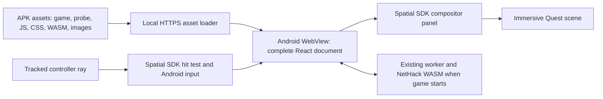

# Quest VR: bundled HTML UI proof and implementation plan

Research date: 2026-09-12. Requirement: a self-contained Quest APK that includes the game and works on first launch without a website, Quest Browser, or a prior online cache fill.

## Current implementation

The user confirmed that the standalone UI APK passed headset testing. The implementation now includes Windowed MR and Immersive native stereo modes; see [current stereo behavior, build instructions and validation](quest-stereo-vr.md). The remainder records the original UI-first architecture and staged port plan.

## Original UI-first decision

Use a separate **Meta Spatial SDK Android app with the existing React document in a WebView compositor panel** for the first proof. The SDK provides the immersive scene, tracked controllers, panel presentation, and Android input delivery. Android WebView supplies actual HTML/CSS rendering. This avoids reimplementing a browser compositor or converting each menu to native UI.

Meta documents WebView panels and ships one in its current MediaPlayer sample. It also documents controller-ray input translation to Android touch events and the sharper text afforded by compositor layers. These establish a supported implementation route, but do not establish that this game's entire UI works on a headset. [Panel input](https://developers.meta.com/horizon/documentation/spatial-sdk/spatial-sdk-2dpanel/), [WebView sample](https://github.com/meta-quest/Meta-Spatial-SDK-Samples/blob/main/MediaPlayerSample/app/src/main/java/com/meta/spatial/samples/mediaplayersample/MediaPlayerSampleActivity.kt), [layer rendering](https://developers.meta.com/horizon/documentation/spatial-sdk/spatial-sdk-2dpanel-layers/).

The repository contains the native project in `quest/`, the UI fixture, and the separate build/staging path. The original UI-only APK was confirmed working by the user. The new native stereo renderer still needs compilation and device validation; repository steering reserves APK builds for the user.

The original UI proof displayed the game canvas flat inside its panel. The current stereo implementation sends resolved game meshes and textures to Spatial SDK while retaining the same HTML UI window; it falls back to the browser canvas when native scene delivery fails.

Local validation completed: TypeScript check; four asset-staging regressions; static Vite configuration checks for normal/Electron/Quest targets; desktop browser interaction and visual checks of the probe. Browser checks covered the real text prompt's focus/submit/cancel, body portal open/close, range and select changes, scrolling to and selecting row 30, and animated dialog focus/close. These results do not pass the hardware gates below. The native implementation's SDK signatures were inspected against the published 0.13.2 binaries; that is still not a Kotlin compilation or device test.

## Why this fits the current game

- [`App.tsx`](../src/ui/App.tsx) renders startup, HUD, prompts, inventory and settings using React. Startup can render before the game engine exists.
- Some content is mounted into `document.body`, including loading UI, option descriptions, and inventory menus. The engine also creates DOM overlays. A snapshot of `#root` would miss those surfaces.
- CSS uses fixed positioning, animation, shadows, gradients and backdrop effects; icons include inline SVG. Preserve the complete WebView document to exercise those real browser features.
- [`gameStore`](../src/state/gameStore.ts) and [`engineUiAdapter`](../src/state/engineUiAdapter.ts) already separate UI state from runtime events. Keep command and prompt ownership in their existing services.
- [`WorkerRuntimeBridge`](../src/runtime/WorkerRuntimeBridge.ts) runs the authoritative NetHack WASM in a worker. A WebView can retain this architecture; worker startup, WASM loading, audio and persistence still require a separate on-device test.
- The existing [`android/`](../android/) app extends Capacitor `BridgeActivity`. The proof uses a separate package and build project, allowing both APKs to coexist. It does not depend on Capacitor exposing WebXR or making its WebView immersive.

## Architecture of the first proof



Serve the whole build at `https://appassets.androidplatform.net/`, mapping `/` to APK assets under `game/`. This is intercepted locally, not a request to a remote host. Preserve root-relative runtime paths and Vite's `/assets/` chunks; mapping only `/assets/` to the application root would break the game's current URL contract. Android recommends `WebViewAssetLoader` for local web content and HTTP(S) API compatibility instead of `file://`. [Android local content](https://developer.android.com/develop/ui/views/layout/webapps/load-local-content).

The shell rejects remote requests, permits JavaScript and DOM storage, and serves resource MIME types including `application/wasm`. A service-worker interception path uses the same origin mapping. Blob URLs remain available for existing in-document/runtime operations. No privileged JavaScript bridge is needed for this proof. The native toolbar can return to the probe or open the game even if a game dialog occupies the page. Its confirmation controls are rendered within that same native panel. Android and XR focus changes pause/resume WebView and its timers; this alone does not guarantee that every worker or audio subsystem is suspended, which is why lifecycle tests remain mandatory.

The panel starts at 1.6 m by 1.0 m, with a 1600 by 1000 dp backing display at 160 dpi. These are test settings, not proven comfort/readability targets. Keep it world-locked. Compare readable text sizes and panel distance on hardware before splitting HUD and modal panels. The proof uses an opaque layer; transparent HUD blending and world occlusion are later tests.

The dedicated Quest build removes the entry HTML's remote Google Fonts links and uses the existing system-font fallbacks. Exact typography may differ from the online desktop app. Fonts can be bundled with their licenses later if needed. Update checks and external links have no network access in the proof; do not mistake those expected failures for missing bundled game assets. File import/export and downloads need native picker/download integration before claiming full UI parity.

## Alternatives considered

| Approach | Assessment for this game |
| --- | --- |
| Spatial SDK + local WebView panel | First choice for proving existing HTML fidelity and input in a fully bundled APK. Native dungeon rendering remains a distinct project. |
| Raw OpenXR + WebView surface | Custom fallback if SDK panel behavior blocks us. Surface swapchains do not automatically attach, lay out or draw a WebView. We would own view presentation, input mapping, threading, synchronization, composition and lifecycle. [OpenXR Android surface extension](https://registry.khronos.org/OpenXR/specs/1.0-khr/html/xrspec.html#XR_KHR_android_surface_swapchain). |
| Meta packaged WebXR PWA | A legitimate immersive APK path, but its hosted HTTPS/TWA model fails the required first-install bundled/offline constraint. [Meta packaging](https://developers.meta.com/horizon/documentation/web/pwa-packaging/). |
| Embedded Wolvic/Gecko WebXR | Could retain more Three rendering code, at the cost of a custom browser/runtime integration. Wolvic documents that standard Maven GeckoView builds lack its WebXR integration. Still needs a strategy for HTML during immersion. [Wolvic](https://github.com/Igalia/wolvic), [developer workflow](https://github.com/Igalia/wolvic/wiki/Developer-workflow). |
| Three HTMLMesh / DOM-to-canvas reconstruction | Useful for small supported controls; not evidence of complete browser-rendering fidelity. The bundled Three `HTMLMesh` manually draws DOM into a canvas and synthesizes selected events. Our portals, native widgets, CSS effects and input behaviors would need extensive compatibility work. [Three implementation](https://github.com/mrdoob/three.js/blob/r178/examples/jsm/interactive/HTMLMesh.js). |
| Emerging HTML-in-Canvas APIs | Worth revisiting when the required Quest WebView version supports them. Chrome describes an evolving trial, not a guaranteed deployed Quest API. [Chrome announcement](https://developer.chrome.com/blog/html-in-canvas-origin-trial). |

## Wired development

For PC-rendered testing through a USB headset, use the [wired development workflow](quest-wired-development.md): run `npm run quest:wired` and open its local WebXR viewer. This preserves real browser HTML rendering during iteration, while the native APK remains the standalone target.

## Build and run the proof

The native project pins SDK 0.13.2 from Meta's official current sample rather than mixing sample code with a newer documentation version. Its Android API baseline is 34. Use Android Studio with API 34 installed and Java 17 or a compatible newer JDK. The existing Gradle wrapper is shared only as a launcher; `-p quest` selects the independent project. [Sample versions](https://github.com/meta-quest/Meta-Spatial-SDK-Samples/blob/main/StarterSample/gradle/libs.versions.toml), [sample build](https://github.com/meta-quest/Meta-Spatial-SDK-Samples/blob/main/StarterSample/app/build.gradle.kts).

For a single Windows command, run `npm.cmd run quest:apk` (or `./BuildQuestApk.bat`) from the repository root. It runs the web build/staging and Gradle assembly in order, stops on failure, and prints the sideloadable `quest/app/build/outputs/apk/debug/app-debug.apk` path. Sideload that debug APK with Meta Quest Developer Hub.

The individual steps from the repository root on Windows are:

```powershell
# Optional: inspect the web fixture on desktop first.
npm.cmd run quest:dev
# Open http://127.0.0.1:5173/quest-ui-probe.html

# Produce a fresh Quest-specific web bundle and stage every asset into the APK.
npm.cmd run quest:sync

# Configure quest/local.properties with sdk.dir, or set ANDROID_HOME.
.\android\gradlew.bat -p quest :app:assembleDebug
```

On macOS/Linux, use `npm` and `bash android/gradlew -p quest :app:assembleDebug`. Opening `quest/` directly in Android Studio requires selecting the shared wrapper or a compatible local Gradle installation; the CLI above is the repeatable starting point.

`build:quest` writes `dist-quest/`, includes both HTML entries and emits `quest-build.json`. `quest:stage` validates that marker, HTML entry resources and the three bundled WASM runtimes before replacing only generated Quest assets. Use `quest:sync` after source changes; `quest:stage` alone deliberately does not rebuild stale source. If using Gradle `clean`, run it before `quest:sync`, since staging lives under the native build directory. Regular browser, Electron and Capacitor builds keep their original entry and output paths.

Find the debug APK under `quest/app/build/outputs/apk/debug/`. Use Android Studio, Meta Quest Developer Hub, or `adb install -r <apk-path>` to install on a Quest in developer mode, then launch **NetHack 3D VR** from Unknown Sources. Its package is `com.nethack3d.quest.uiproof`. Native dependency downloads are build-time requirements; the installed proof must run without internet. Debug signing is sufficient for this sideload test. Store submission, release signing and entitlement integration are outside this proof.

## Acceptance checklist: record evidence before proceeding

Use a fresh install or clear **only the proof app's** data, disable headset Wi-Fi, and record device model, Horizon OS and WebView provider/version. Start with the oldest device we intend to support; then repeat on another Quest model. Quest 1 is not part of the sample's advertised Quest 2/3/3S/Pro baseline. [Sample requirements](https://github.com/meta-quest/Meta-Spatial-SDK-Samples).

| Gate | Required evidence |
| --- | --- |
| Native package and cold offline boot | APK compiles, installs and launches into its own immersive scene. Probe and game assets load on first launch without cached content or a server. No missing JS, CSS, images or WASM. |
| Actual HTML rendering | Text, SVG icons, borders, gradients, animation, clipped scrolling and body portals appear correctly in both eyes. Opening a portal does not duplicate or detach it. Compare full-game startup/settings against desktop. |
| Ray interaction | Each controller can click, cancel, select, scroll and drag. A click fires once; release outside the target does not leave dragging or pressed state stuck. Hover-only help must remain accessible. |
| Text input | Quest keyboard opens for the real text dialog; type, edit, submit, cancel and reopen. Focus returns to the right control and no command leaks into gameplay. A desktop keyboard check alone does not pass this gate. |
| Existing game flows | Start a character; inspect inventory and context menus; select multiple pickup items; answer yes/no and direction prompts; drag settings sliders; open long message history; cancel nested dialogs. Verify state and commands against the existing runtime. |
| Runtime and saves | Start each supported WASM variant offline, take a turn, save, close and relaunch. Verify expected saves persist under the new app/origin. Test sound startup and recovery separately. A fixture with mock state cannot pass this gate. |
| Lifecycle | Open Universal Menu, remove/re-wear headset, pause/resume and relaunch. Keyboard, audio and panels recover; no duplicate WebViews, runaway worker, stuck input or unintended turn. Native panel Game/Probe navigation intentionally reloads the document: save before switching. |
| Performance and readability | Record actual headset refresh rate, frame-time distribution, missed frames, memory and thermal behavior during UI animation and long scrolling. Record panel resolution and distance. At 72 Hz a frame interval is 13.9 ms; at 90 Hz it is 11.1 ms. These are budgets, not measured results. |

Keep the acceptance results in a follow-up note with APK/commit identification, reproduction steps, and video/screenshots where helpful. The initial stop/go decision requires native package, offline boot, rendering, ray, text-input and lifecycle gates to pass. Fix the WebView panel path before beginning a large dungeon renderer port if any of those fail.

## Original follow-on plan and remaining parity work

The follow-on work is substantial: Spatial SDK does not render a `THREE.Scene` or adopt its WebGL context. A UI panel test does not make the existing engine stereoscopic. Choose a native dungeon renderer if the proof succeeds and its maintenance cost is acceptable; keep the embedded-browser alternative as a separate research branch if preserving every Three effect becomes the dominant requirement.

1. **Separate presentation from game state.** Add a narrow presentation output to the existing engine subsystems, preserving one worker, one runtime, prompt ownership and `Nethack3DEngineController`. Produce resolved tile/entity/material snapshots using existing glyph, tileset and visibility logic. Do not reinterpret raw NetHack glyph IDs independently in Kotlin. Add a UI/native mode only after the normal Three renderer can be disabled without losing world processing or DOM overlays.
2. **Prove a small stereo scene.** Render a floor, walls, player/pet and a few atlas sprites natively alongside the same WebView panel. Test binocular depth, head translation, recentering, scale and coordinate conversion. The game uses Z-up Three coordinates; Spatial's native coordinate system uses Y-up and a different handedness. Implement one explicit conversion with fixture tests. Spatial supports bundled models and procedural meshes. [Native scene objects](https://developers.meta.com/horizon/documentation/spatial-sdk/spatial-sdk-3dobjects/).
3. **Bridge changes and commands.** Send an initial snapshot and ordered batches of deltas containing protocol version, runtime identity, session/level generation and revision. A generation change or revision gap forces a full resync. Bound payloads and coalesce superseded visual updates. Use an origin-restricted WebView message listener; validate commands and route them through current controller methods. Keep headset/controller tracking and rendering native each frame, rather than sending head poses through JavaScript. [AndroidX messaging APIs](https://developer.android.com/reference/androidx/webkit/WebViewCompat).
4. **Add VR interaction.** Start seated with a tabletop dungeon and discrete turn-based movement. Define UI capture priority, neutral/release cancellation, recenter and comfort controls. Native ray selection resolves a tile and calls the existing game action. Reuse inventory/direction/text prompt state. Test haptics and audio via an explicit Quest platform adapter instead of pretending Capacitor plugins are installed.
5. **Reach rendering and runtime parity.** Port visibility, tilesets, billboards, lighting, minimap and effects in measured increments. Keep terminal presentation as a panel where appropriate. Validate every runtime variant, stairs/level changes, player position updates, tile refreshes, inventory/direction prompts, save/load, interruptions and extended commands. Add file picker/export and any desired offline fonts.
6. **Release packaging.** Establish supported devices/OS floor, manifest and store checks, release signing, update strategy, licenses, save migration and sustained performance targets. Do this only after a real stereo scene and complete UI interaction are demonstrated in the same APK.

The UI-proof gate passed. The next hardware check is the native stereo APK, followed by rendering/performance and full input parity; see the current stereo guide.
