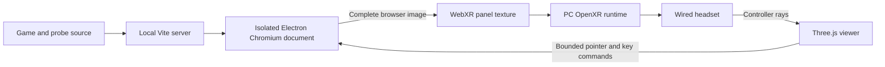

# Wired headset development

> For the new direct Three.js renderer and live HTML-pane proof, see [quest-webxr-runtime.md](quest-webxr-runtime.md). This document describes the earlier experiment.

Use this workflow for **PC-rendered VR through Quest Link or a compatible OpenXR headset/runtime**. It runs the existing HTML UI on the PC and needs no APK rebuild for web changes. The standalone Quest project is still the final packaged target; the wired preview does not validate Android WebView performance or Quest's native keyboard.

## Run

1. Connect the Quest using a USB data cable and launch wired Quest Link. For another PC headset, start its OpenXR runtime. Meta's documented Link workflow is Windows PCVR. [Meta Link setup](https://developers.meta.com/horizon/documentation/unity/unity-link/).
2. Set the runtime for the headset as the active OpenXR runtime. This PC was already configured for Meta Horizon Link when checked on 2026-09-12; the preview does not change that setting.
3. From the repository root run:

   ```powershell
   npm.cmd run quest:wired
   ```

4. Open the **complete URL printed in the terminal** in a WebXR-capable desktop Chrome or Edge browser. It starts with `http://127.0.0.1:5175/quest-wired.html#token=...`. The fragment authenticates this local preview session. Use the printed `127.0.0.1` address, not `localhost` or a LAN address.
5. Select **Enter VR**. If the headset is unavailable, finish starting Link/SteamVR and select **Check headset**. The browser and active runtime must expose an `immersive-vr` session with `local-floor` support.
6. The initial panel contains the existing UI fixture. Use **Full game** and **Continue** on the panel's lower toolbar to open the real game. Save before switching pages or restarting the host.

Stop with Ctrl+C. Restarting the host produces a new URL/token, so reopen the printed URL. Development game data is separate from the normal Electron and Quest apps, under the ignored `.wired-dev/` directory. Keep that directory if you want to retain development saves.

No APK, production build, external game hosting or additional npm dependency is needed. Installed project dependencies, including Electron, are required. The server binds only to loopback on port 5175. Vite serves the current source and updates it as you edit. Source changes that reload a game document can end an unsaved game; use the runtime-free probe for rapid UI iteration.

## Controls

| Input | Behavior |
| --- | --- |
| Controller ray + trigger | Point, click, or hold and drag in the actual browser document. |
| Thumbstick vertical axis | Scroll the UI under the ray. |
| Keyboard button below the panel | Show a ray-operated keyboard; letters also reach game key handlers. |
| Escape / Back | Send Escape to the UI/game. |
| Recenter | Place the panel in front of the current view, with an upright orientation. |
| Exit VR | Return to desktop preview. Enter VR can start another session. |
| Desktop mouse | Click/drag the displayed panel; wheel scrolls the content under the pointer. |
| Desktop keyboard | After clicking the panel, send printable keys, Enter, Escape, Tab, Backspace and arrows to the source. Ctrl/Alt/Meta shortcuts remain with the desktop browser. |

One controller owns a drag until release. Releasing outside the UI or losing session focus cancels the pressed input rather than activating the last hovered button. The preview keyboard is a development tool; it does not represent Quest's native IME, international keyboard layout, or final VR input design.

## How it works



Electron renders only a window created by this development host; it does not capture the desktop or other applications. Its offscreen rendering keeps the browser's actual HTML/CSS/WebGL composition, including React portals. The viewer sends a small allowlist of input actions to that same window through Electron's debugger interface. It does not expose arbitrary debugger commands. Focus is emulated on the offscreen document so the VR browser can retain OS focus. [Electron offscreen rendering](https://www.electronjs.org/docs/latest/tutorial/offscreen-rendering/), [debugger API](https://www.electronjs.org/docs/latest/api/debugger), [Chromium input protocol](https://chromedevtools.github.io/devtools-protocol/tot/Input/).

The source is 1600 × 1000 CSS pixels and produces up to 20 UI images per second. The viewer renders head tracking and the panel at the headset's XR frame rate independently. This intentionally prioritizes a simple development connection; image readback, PNG encoding and upload add latency. It is not a performance model for the native Quest compositor, and the full game's dungeon is still a flat canvas within the panel.

Files:

- [`scripts/quest/wired/`](../scripts/quest/wired/): Electron/Vite launcher, offscreen host, restricted input protocol and tests.
- [`quest-wired.html`](../quest-wired.html) and [`src/quest/wired-viewer/`](../src/quest/wired-viewer/): WebXR presentation, controller picking, virtual keyboard and desktop preview.
- [`quest/`](../quest/): independent fully bundled native APK proof, unchanged by the wired workflow.

## Validation and limits

Current validation (2026-09-12): TypeScript passed; 14 host/protocol tests and 20 viewer input/transport tests passed. The live Electron/Vite host started, reported the probe ready and returned advancing 1600 × 1000 PNG frames; a captured frame showed the complete styled fixture. Browser automation was unavailable after the session interruption, so the WebXR presenter, live input against the source, physical headset entry, and XR exit/re-entry remain unverified. These checks are required before calling the wired route proven.

Run `npm.cmd run quest:wired:test`, `npm.cmd test -- src/quest/wired-viewer/`, and `npm.cmd run check:tsc` for focused validation. These cover input mapping, message bounds, cancellation and queue ordering; they do not establish headset tracking or browser compositor fidelity.

Before accepting the wired path, verify the streamed real text prompt, a body portal, range dragging, native select popup, list scrolling and source navigation. Then check trigger release outside a button, both controllers, keyboard entry, Universal Menu interruptions, Exit VR and re-entry on the physical headset. If a browser-native popup is missing from the captured image, record it as a capture limitation; do not infer that the Android implementation shares that failure.

File pickers, downloads, external links and privileged browser permissions are not provided by this development host. Test those later in the native shell. Standalone offline boot, Quest keyboard placement, Android lifecycle and sustained headset performance remain separate gates in the [Quest implementation plan](quest-vr-plan.md).
