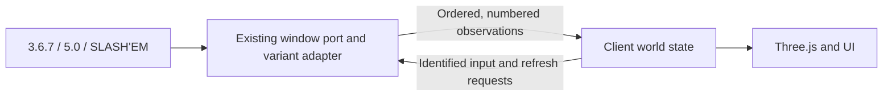

# Runtime communication: staged contract proposal

Status: proposal only, not a plan we've chose to action or committed to code yet. Inspected on `vr-v2` at `3eb7c47186d5f2f6690ef78c10ff02ceac0e0018`. No runtime, imported game, or generated WASM changes accompany this document.

## Recommendation

Introduce an explicit, versioned protocol between the existing runtime adapter and the client. Start with typed records, session/update identifiers, input-request identity, and refresh completion. Preserve callback order and the current variant adapters. Change batching and remove retry heuristics only after recording equivalent behavior for every supported runtime.

Larger reductions in native calls should be a separate change to the WASM/window-port integration, implemented and validated for NetHack 3.6.7, NetHack 5.0 and SLASH'EM together. Keep the game simulation and its display algorithms upstream-owned.

NetHack owns rules and the observations available to the player. The client owns camera, animation and rendering. The adapter translates between them. NetHack does not need to know about meshes or wait for a GPU frame to finish.

## What the current code establishes

| Finding | Evidence | Consequence |
| --- | --- | --- |
| Map transport already batches and coalesces tiles, with up to 384 tiles per emitted chunk | [runtime-worker.ts](../src/runtime/runtime-worker.ts), `schedulePendingMapGlyphFlush`, `flushPendingMapGlyphEvents`, `postEnvelope` | Adding another collection called a batch is insufficient. Measure native callbacks and worker messages separately |
| Map batches flush at a microtask or before another event | Same worker functions | These are transport boundaries, not a definition of a completed action or turn |
| Incoming events use an open string type and arbitrary fields | [types.ts](../src/runtime/types.ts) | Payload completeness and distinctions between event kinds are weakly checked |
| The input broker already preserves FIFO, single consumption and request-kind targeting | [RuntimeInputBroker.ts](../src/runtime/input/RuntimeInputBroker.ts), [input-requests.ts](../src/runtime/local/input/input-requests.ts) | Build on this implementation; do not introduce a competing input queue |
| Active input request identity is represented by the worker's pending Promise, not a wire request ID | `RuntimeInputRequests.requestInputCode` | A client response cannot explicitly name the particular wait it answers |
| Refreshes can be deferred while returning cached data; client refresh retries run after 120 and 240 ms | [tile-refresh.ts](../src/runtime/local/world/tile-refresh.ts), [tile-updates.ts](../src/game/engine/world/tile-updates.ts) | A returned tile is not necessarily proof that a requested fresh observation completed |
| Every registered callback currently passes through an `async` wrapper | [bootstrap.ts](../src/runtime/local/startup/bootstrap.ts), `initializeNetHack` | Worker message batching alone cannot eliminate per-callback Promise/suspension overhead |
| Render updates already have budgets, entity tracking, terrain preservation and player-position fences | [tile-updates.ts](../src/game/engine/world/tile-updates.ts), [world/runtime guide](engine-world-runtime.md) | Preserve these rules while changing transport grouping |

### Cross-game differences verified in WSL

The current runtime staging script uses `packages/wasm-367`, **`packages/wasm-5`**, and the separate `slashem-wasm` checkout; `wasm-37` is not the current 5.0 staging target. See [copy-wasm.mjs](../scripts/wasm/copy-wasm.mjs).

| Property | NetHack 3.6.7 | NetHack 5.0 | SLASH'EM |
| --- | --- | --- | --- |
| Tracked `shim_print_glyph` payload | Glyph and background values, then entity/attack IDs | Foreground/background `glyph_info` pointers, then entity/attack IDs | Glyph value, then entity/attack IDs; no background argument |
| Status order in `flush_screen` | Map, cursor/window display, then status | Status, then map and cursor/window display | Map, cursor/window display, then status |
| Glyph helper | `mapglyphHelper` | `mapGlyphInfoHelper` plus compatibility helper | `mapglyphHelper` with legacy function signature |
| Arbitrary floor helper in inspected `js_helpers_init` | Not installed | `floorGlyphAtHelper` installed | Not installed |
| Under-player item helper | Present | Present | Present, with a smaller helper surface |
| Combat notifications | Existing tracked attack/death path | Existing tracked attack/death path | Existing tracked attack/death path |

Source roots:

- `/home/james/Repos/forked/neth4ck-monorepo/packages/wasm-367/NetHack`
- `/home/james/Repos/forked/neth4ck-monorepo/packages/wasm-5/NetHack`
- `/home/james/Repos/slashem-wasm/slashem-0.0.7E7F3`

In each root, inspect `win/shim/winshim.c`, `src/display.c`, and `sys/libnh/libnhmain.c`. Particularly relevant: 3.6.7 `display.c:1640`, 5.0 `display.c:2208`, and SLASH'EM `display.c:1535`.

The 5.0 display loop reuses a local background `glyph_info`. Any deferred batch must copy its values while the callback's data is valid. Retaining the pointer for later decoding would be incorrect.

## Proposed contract

The following describes intended semantics, not an implemented API.

### 1. A startup handshake

Publish protocol version, actual runtime/artifact identity, validated pointer ABI, map dimensions, and supported capabilities. Distinguish features supplied by the common adapter from native exports. Inspect helper existence without invoking unsafe probes.

The same client-facing contract applies to all three games. Variant differences stay in their adapters. Existing verified ABI profiles remain the fallback for older artifacts; unsupported features are explicitly unavailable. An unknown ABI must not be guessed from argument count. Select the transport mode once at session startup so legacy and new publishers cannot emit the same effects twice.

### 2. Ordered update records and explicit boundaries

A transport envelope contains `protocolVersion`, `sessionId`, sequence range, batch ID, an ordered list of records, and a boundary reason. Records retain the relevant level/presentation generation. A game-turn number can be included for diagnostics but is not the sequence number.

- Use monotonically increasing sequence numbers for order within a session. Timestamps remain diagnostic.
- Keep level identity/generation separate from presentation reset generation. `clear_scene` can mean redraw or reconnect; it does not prove a level change and does not clear the worker's map cache.
- Preserve map, cursor/player, status, under-player item, combat, prompt and clear ordering inside each batch.
- Distinguish a map-display boundary, a status flush, a prompt boundary and a transport-size split. Never present a size-limited chunk as a complete observation.
- Preserve intermediate travel steps, temporary effects and prompts. One command can span many turns or stop midway for an answer; an action can also consume no turn.
- Existing `display_nhwindow(WIN_MAP)`, input waits, clear events and delay callbacks are candidates for explicit markers after tracing their semantics. `mark_synch`/`wait_synch` names alone are not a portable turn-completion guarantee.
- A numbered batch improves traceability but does not prove state completeness. Require an explicit completion marker for a chunked snapshot.

Initially, the client should replay records through the existing handlers in exactly their established order. Do not replace them with a new world model in the same change.

### 3. Input identity and observable consumption

Give each client submission a command ID. Give each actual pending input wait a request ID. Include callback kind and purpose where the adapter knows it; use `unknown` where it does not. A low-level `nhgetch` or `nh_poskey` alone does not prove the game is asking for an ordinary movement command.

Prompt/menu/text responses name their request ID. A late response to a closed prompt is rejected explicitly rather than answering another prompt. Cover all owners, including menu and text waits outside the broker's basic key path.

Keep normal typeahead and synthetic command sequences on the current bounded FIFO with kind targeting. A sequence needs consumption reporting by token index because its tokens can satisfy different waits. Distinguish received/queued, consumed, cancelled and rejected. **Consumed means the game read the input; it does not mean the action finished.**

The client can report its last processed sequence cumulatively or piggyback it on input. This is observability, not a new requirement for NetHack to wait on each rendered tile. Distinguish model processing from visual animation completion.

### 4. Refresh completion and freshness

Replace repeated individual repair attempts with an identified request for a set of cells, scoped to the session/level generation. A result identifies the request and distinguishes:

- freshly queried and complete, including an unchanged result;
- cached presentation only;
- deferred until a verified helper-safe opportunity;
- unavailable, failed, or cancelled by a session/level transition.

State which observation sequence satisfies the request. For post-action checks, receiving or consuming an input is insufficient: the fresh observation must occur after the relevant state change. Keep current heuristics until this relationship is demonstrated for the affected flow.

Deduplicate overlapping cell requests within the same generation and freshness requirement. A cached response must not cancel a request that needs fresh data. Never manufacture an input just to service a refresh. Also, waiting for input does not automatically make re-entering WASM safe: preserve the existing query guard until the native boundary is audited.

Once verified, this lets the client stop scheduling speculative 120/240 ms retries. A timeout may still diagnose a stuck operation; it should not certify correctness or automatically replay gameplay input.

### 5. Complete, player-visible cell observations

Use one common schema for foreground appearance, known terrain/background, optional under-player item, tracked entity, glyph flags and source/freshness metadata. Distinguish “unavailable/unknown” from “known empty”; legacy helper failures or ambiguous sentinels cannot establish absence.

Derive these values from existing runtime display observations and visibility rules. Do not export hidden creatures or unexplored terrain, or replace hallucinated/remembered presentation with omniscient dungeon data. Preserve runtime item tile indices and classification over generated catalog fallbacks.

This schema permits each adapter to provide what its game supports without scattering version checks through the renderer. Existing inference paths remain where authoritative information is unavailable.

## Reducing work at each boundary

| Boundary | Useful change | Limit |
| --- | --- | --- |
| Client → worker | One identified refresh-set request; deduplicate overlapping repairs; stop satisfied requests | Does not reduce native per-cell helper work by itself |
| Worker → client | Ordered batches at verified boundaries, plus chunked full snapshots and normal deltas | Does not remove native callbacks or their asynchronous crossings |
| Client → Three.js | Apply every required state transition; collect dirty visuals; rebuild affected tiles/neighbors once per safe boundary | Combat, move tracking, transient effects and superseded terrain cannot be discarded merely because a later tile value exists |
| WASM → adapter | Optional native buffer of copied, normalized map observations; bulk cell-query helper | Requires coordinated integration changes and new artifacts for all three games |

There is concrete helper overhead to investigate: 3.6.7 and SLASH'EM's `mapglyphHelper` allocate/free three scratch values per query; 5.0's helper allocates a glyph-info record. A bulk export could compute multiple requested cells and return one owned result. This is a candidate, not a measured speedup. A synchronous fast path for selected callbacks is another candidate, but changing all `void` callbacks would be wrong: some represent intentional waits or delays.

Asyncify's suspension and re-entry rules matter here. Do not introduce concurrent WASM calls, alter callback return timing, or retune Asyncify instrumentation as part of the first protocol change. Emscripten documents both re-entry hazards and the risk of incorrect manual instrumentation settings. [Asyncify documentation](https://emscripten.org/docs/porting/asyncify.html#potential-problems)

## Keeping upstream merges manageable

For a later native optimization, target the existing window-port/WASM boundary, with small variant-specific wrappers and a shared specification. Put new bridge implementation in a separate integration file where feasible, connected through small includes/build hooks. Avoid spreading new notifications through movement, combat and inventory core files; existing combat hooks already provide a path to preserve.

Define owned, versioned output records rather than exposing native C structs or borrowed pointers asynchronously. Copy buffers before WASM resumes and preserve the existing ordering of queued inventory/combat notifications relative to map callbacks. Large buffers need bounded chunks and an explicit completion marker; yielding/backpressure must preserve input and animation opportunities.

Feature detection is a compatibility mechanism, not permission to deliver different behavior to one game. Implement all three adapters and gate release of a native capability on all three artifact builds and conformance results. Stage matching JS/WASM pairs with manifest/ABI identity checks.

## Rollout and proof

1. **Trace and specify, client repository only.** Capture representative existing callback/event streams, count crossings, define typed records and metadata. Keep legacy dispatch and presentation behavior.
2. **Add request lifecycle, client repository only.** Add request IDs, consumption/freshness reporting and refresh-set support through the shared adapter. Observe alongside existing retries before removing any.
3. **Change batching and visual scheduling separately.** Compare normalized event order, final known map, player/cursor state, under-player items, combat/effect counts and prompt lifecycles against the legacy path for each variant. Preserve established player-position and level-transition fences.
4. **Review optional native patch.** Only if measured remaining costs justify it, implement a bulk observation/query path for all three games, rebuild/stage all artifacts, and repeat conformance and device checks. WSL modifications require user input before work starts there.

Compare old versus new behavior **within each game**. The games need to obey the same communication guarantees; they do not need to generate identical worlds or combat outcomes to one another.

Required scenarios include rapid typeahead; runs/travel interrupted by a prompt; direction, far-look, menu and text cancellation; partial pickup/drop/eat and boulder pushes; blindness, hallucination and remembered terrain; entity swaps, teleport/death and blood effects; branch/level changes; redraw and reconnect; save/restore and game-over dialogs; and chunked map bursts while visuals are still animating. Repeat in relevant tiles, FPS, terminal and VR modes, including Android/Quest.

Measure callbacks, WASM helper crossings, worker messages/bytes, refreshes per action, duplicate tile rebuilds, main-thread work and input latency. Fewer messages alone is not a performance result if they arrive late or move more work into one long frame.

**Suggested first implementation:** typed/versioned observations plus identified refresh completion, backed by traces for all three runtimes. Keep source-game changes as a separately reviewed follow-up.
