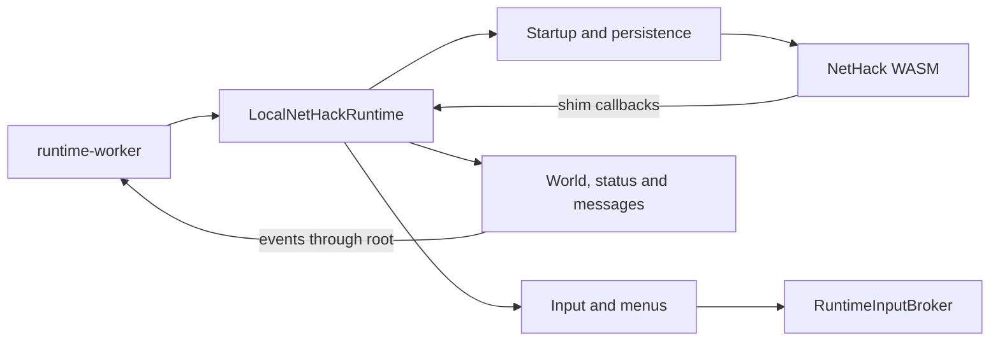

# Local runtime subsystems

[LocalNetHackRuntime.ts](../LocalNetHackRuntime.ts) is the worker-facing facade. It coordinates construction, startup, callback guards and dispatch, public commands, event delivery, reconnect ordering, and shutdown. The classes here own runtime adapter state and implementation. NetHack's authoritative game rules and world still run in WASM.

[create-runtime-systems.ts](create-runtime-systems.ts) constructs the owners and wires their explicit dependencies. Each class declares a dependency interface with `Pick<Peer, ...>` for the members it uses. [runtime-coordinator.ts](runtime-coordinator.ts) defines the root state and operations available to owners. Dependencies never receive the complete runtime facade or a duplicate state bag.

Peer imports are type-only. Assembly uses getters so calls and assignments reach the current owner, including after a menu map, input queue, or position object is replaced. Getters do not make eager initialization safe by themselves: construct eager dependencies before consumers. All owners must exist before WASM startup, callback registration, and `main` execution begin.

The extracted implementation retains the previous `@ts-nocheck` boundary for dynamic WASM and callback values. The root facade, assembly and coordinator contract are type-checked, and owner fields are declared explicitly. This is an ownership refactor, not a complete typing migration; a successful type check does not validate arbitrary runtime heap layouts or every callback body.

## Code hotspots

Paths in this table are relative to this directory.

| Task or state | Owner and starting methods |
| --- | --- |
| Worker-facing API, callback guards, startup and shutdown ordering | [../LocalNetHackRuntime.ts](../LocalNetHackRuntime.ts): `start`, `shutdown`, `handleUICallback`, `emit` |
| WASM loading, hooks and main invocation | [startup/bootstrap.ts](startup/bootstrap.ts): `initializeNetHack`, `registerRuntimeCallbackAndStartMain` |
| Runtime artifact URLs and build tags | [startup/runtime-assets.ts](startup/runtime-assets.ts); fallback URL resolution uses the root's `runtimeSourceUrl` |
| Startup options, character name and configuration | [startup/startup-configuration.ts](startup/startup-configuration.ts) |
| No-callback startup timer and callback count | [diagnostics/startup-diagnostics.ts](diagnostics/startup-diagnostics.ts) |
| Save mounts, IDBFS and checkpoint sync wrappers | [persistence/startup-persistence.ts](persistence/startup-persistence.ts) |
| Checkpoint files, recovery and Slash'EM locks | [persistence/checkpoint-files.ts](persistence/checkpoint-files.ts), [checkpoint-recovery.ts](persistence/checkpoint-recovery.ts), [slashem-locks.ts](persistence/slashem-locks.ts) |
| Pointer ABI profiles, callback shape validation and safe fallback returns | [abi/pointer-contract.ts](abi/pointer-contract.ts): `buildDefaultRuntimePointerContract`, `validateCallbackPointerContract` |
| Pointer normalization and heap reads | [abi/memory.ts](abi/memory.ts) |
| Client keyboard, sequence and mouse routing | [input/client-dispatch.ts](input/client-dispatch.ts): `handleClientInput`, `handleClientInputSequence`, `handleClientMouseInput` |
| Broker, active request identity and question waits | [input/input-requests.ts](input/input-requests.ts): `requestInputCode`, `consumeInputResult`, `waitForQuestionInput`; broker implementation remains in [../input/RuntimeInputBroker.ts](../input/RuntimeInputBroker.ts) |
| Key translation and number-pad mode | [input/keyboard.ts](input/keyboard.ts) |
| Mouse tokens and `nh_poskey` pointer writes | [input/mouse-poskey.ts](input/mouse-poskey.ts): `applyMouseTokenToPoskeyRequest` |
| Position mode, cursor and far-look FSM | [input/position-selection.ts](input/position-selection.ts): `handleShimNhPoskey` |
| Y/N and direction questions | [input/questions.ts](input/questions.ts): `handleShimYnFunction` |
| Text requests, responses and stdin bytes | [input/text-input.ts](input/text-input.ts): `handleShimGetlin` |
| Contextual look/glance automation | [input/contextual-look.ts](input/contextual-look.ts) |
| Extended-command requests and WASM command catalog | [input/extended-commands.ts](input/extended-commands.ts), [extended-command-catalog.ts](input/extended-command-catalog.ts) |
| Travel pacing and duplicate delay suppression | [input/travel-delay.ts](input/travel-delay.ts): `handleShimDelayOutput` |
| Menu capture, finalization and inventory event decisions | [menus/menu-capture.ts](menus/menu-capture.ts): `handleShimStartMenu`, `handleShimAddMenu`, `handleShimEndMenu` |
| Selection maps, menu waiters, cancellation and WASM result rows | [menus/selection.ts](menus/selection.ts): `handleShimSelectMenu`, `resolveMenuSelection`, `writeMenuSelectionResult` |
| Inventory context actions, snapshots and tile-context choices | [menus/inventory-context.ts](menus/inventory-context.ts), [inventory-snapshots.ts](menus/inventory-snapshots.ts), [tile-context.ts](menus/tile-context.ts) |
| Map cache, player position, glyph and tracked combat callbacks | [world/map-callbacks.ts](world/map-callbacks.ts): `handleShimPrintGlyph`, `handleShimCliparound`, `handleShimCurs` |
| Live glyph metadata and classification | [world/glyphs.ts](world/glyphs.ts) |
| Tile/area refresh requests and deferred refresh queues | [world/tile-refresh.ts](world/tile-refresh.ts) |
| Post-action player-tile refresh intent and pending snapshots | [world/post-action-refresh.ts](world/post-action-refresh.ts) |
| Authoritative under-player item queries and events | [world/under-player-items.ts](world/under-player-items.ts) |
| Globals, level identity, object tile maps and reconnect replay | [world/global-snapshots.ts](world/global-snapshots.ts): `buildRuntimeGlobalsSnapshot`, `sendReconnectSnapshot` |
| Runtime-specific window IDs | [messages/windows.ts](messages/windows.ts) |
| Window text buffers, display files and map-window clearing | [messages/window-text.ts](messages/window-text.ts): `handleShimDisplayNhwindow`, `handleShimClearNhwindow` |
| Text, raw-print and message-history callbacks | [messages/message-callbacks.ts](messages/message-callbacks.ts) |
| Prompt context and recent callback history | [messages/prompt-context.ts](messages/prompt-context.ts) |
| Status decoding, pending flushes and latest-value cache | [status/status.ts](status/status.ts): `handleShimStatusUpdate`, `flushPendingStatusUpdates` |
| Game-over sequence, possessions flow, summary and tombstone | [lifecycle/game-over.ts](lifecycle/game-over.ts) |

## Ordering and ownership rules

- Keep closed-session checks, callback accounting, startup timer clearing, diagnostics, and pointer-contract validation ahead of callback dispatch. Invalid arguments return the callback's established safe value before domain logic runs.
- Verbose callback/glyph/status log formatting is gated by `isLoggingEnabled`. This gate must not skip callback history, pointer validation, live glyph helpers, map mutation, status baselines or event delivery. Diagnostic persistence is separate from the worker's ordered gameplay transport.
- Preserve synchronous returns and existing Promise identity/timing. A callback extraction must not introduce an `async` wrapper. Menu continuations must read current state when they resume.
- Route all key-consuming waits through `RuntimeInputRequests` and its broker. Preserve target request kinds, FIFO single-consume behavior, and active request identity.
- Background inventory refreshes are coalesced by `RuntimeInputRequests` and run only at normal command-position waits. Never queue a raw `i` behind gameplay commands: an intervening sale question could consume it as an answer. Far-look/travel position waits and other prompts must preserve the pending refresh.
- Write menu result rows while the selected entries still exist. Then clear selections and resolve/reset waiter state in the established order. The NetHack caller owns previously returned menu buffers; do not free them in the adapter.
- Keep far-look, direction/question, and position transitions synchronous with their emitted events. `cliparound` in position-input mode moves the cursor, not the player.
- Status callbacks update the latest cache immediately and queue pending fields. Flushes sort numeric field indices, clear the pending map before delivery, then emit in order. Reconnect replay reads the owner's live latest cache.
- Map-window clearing resets text capture and emits `clear_scene`; it does not erase the runtime map cache. Reconnect replay emits scene clear, command catalog, map chunks, player position, latest status, inventory, then recent messages in the existing order.
- Keep startup closure state and IDBFS wrapper receivers intact. Ordinary filesystem wrapper functions use their own `this`, not a runtime owner. Preserve run-dependency removal, persistence completion, and main-call ordering.
- Keep coordinated shutdown in the root. It drains input, clears domain state, resolves pending selections/commands, and cancels remaining broker requests in the existing order.

## Validation and related guides

Use `npm run check:tsc` and focused regression tests. Do not run builds or packaging as part of routine agent validation. Unit checks do not replace a running-client check of movement, visible tile refresh, inventory/direction prompts, or teardown and restart.

Regression coverage lives in [input lifecycle tests](input/runtime-input-lifecycle.test.ts), [world refresh tests](world/runtime-world-refresh.test.ts), [callback and menu tests](runtime-callback-state.test.ts), and [startup and snapshot tests](runtime-startup-snapshot.test.ts). They exercise assembled owners with controlled WASM boundaries, including pending request identity, cancellation, heap writes and hydration ordering.

The worker transport and public envelope types remain in [runtime-worker.ts](../runtime-worker.ts), [WorkerRuntimeBridge.ts](../WorkerRuntimeBridge.ts), and [types.ts](../types.ts). For the other side of the boundary, see the [engine guide](../../game/engine/README.md), [world/runtime flows](../../../docs/engine-world-runtime.md), [movement flow](../../../.agents/rules/movement-flow.md), and [pointer ABI troubleshooting](../../../docs/pointer-abi-troubleshooting.md).
