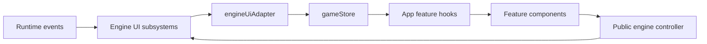

# React UI architecture and code hotspots

[App.tsx](App.tsx) composes the React views. [useAppModel.ts](app/useAppModel.ts) wires feature hooks in their established order, and [use-engine-lifecycle.tsx](app/session/use-engine-lifecycle.tsx) creates and disposes the engine. Feature implementation lives under `app/`, grouped by the state, interaction or presentation it owns. The engine remains responsible for gameplay commands and runtime prompt state; the React layer renders that state and sends commands through the public controller.

## Data and input flow

The [store](../state/gameStore.ts) holds live gameplay state and the controller reference. The [adapter](../state/engineUiAdapter.ts) translates engine UI updates into store updates. Runtime-owned questions, inventories and information menus remain in that store; dialog-local drafts, focus refs and presentation state belong to the relevant React hooks.

## Ownership rules

- Keep `App.tsx` and its composition layer focused on wiring. Add behavior to a feature owner and pass the exact dependencies that it consumes.
- Keep hooks unconditional and preserve their order. Some feature hooks have separate state, derivation and effect sites because other features run between them. Combining those sites can change event-listener priority and layout-effect timing.
- Preserve dependency-array semantics and callback identities. A dependency getter supports an existing deferred closure read; it does not make an eager read safe before initialization.
- Declare React components at module scope. Moving a component definition inside another component changes its identity and can reset focus or local state on every render.
- Keep DOM ids, class names, portal destinations and existing fragments stable. CSS, the engine's controller navigation and layout measurement depend on them.
- Preserve `AnimatedDialog` mounting and its inner visibility conditions. Closing an animated dialog and removing its children are separate operations in several flows.
- Use named ref props when passing refs through a component boundary. React's `ref` attribute is not an ordinary function-component prop.
- Keep controller commands, prompt lifecycle transitions and runtime event handling in their existing engine owners. See the [engine guide](../game/engine/README.md).

## Code hotspots

| UI behavior | State and interaction owner | View |
| --- | --- | --- |
| Startup character selection and launch | [startup state](app/startup/use-startup-state.tsx), [character creation](app/startup/use-character-creation.tsx) | [CreateCharacterDialog](app/startup/CreateCharacterDialog.tsx), [RandomCharacterDialog](app/startup/RandomCharacterDialog.tsx) |
| Save selection and recovery | [saved-game sections](app/startup/use-saved-game-sections.tsx), [saved-games helpers](app/startup/saved-games.ts) | [ResumeGameDialog](app/startup/ResumeGameDialog.tsx) |
| New game, tombstone and deferred prompt | [new-game actions](app/startup/use-new-game-prompt.tsx), [deferred prompt listeners](app/layout/use-keyboard-overlays.tsx) | [NewGameDialog](app/startup/NewGameDialog.tsx) |
| Apply or discard client options | [client-options actions](app/settings/use-client-options-actions.tsx), [applied-option effects](app/settings/use-applied-client-options-effects.tsx) | [ClientOptionsDialog](app/settings/ClientOptionsDialog.tsx) |
| Render option controls and their conditional settings | [option descriptors](app/settings/config.ts), [slider draft](app/settings/use-client-slider-draft.tsx) | [toggle controls](app/settings/ClientOptionToggleControl.tsx), [select controls](app/settings/ClientOptionSelectControl.tsx), [slider controls](app/settings/ClientOptionSliderControl.tsx), [color controls](app/settings/ClientOptionColorControl.tsx) |
| Import, edit and preview tilesets | [manager actions](app/settings/use-tileset-manager-actions.tsx), [tile previews](app/tilesets/use-tile-previews.tsx) | [TilesetManagerDialog](app/settings/TilesetManagerDialog.tsx) |
| Capture controller bindings | [controller remapping](app/settings/use-controller-remapping.tsx) | [ControllerRemapDialog](app/settings/ControllerRemapDialog.tsx) |
| Navigate startup with a gamepad | [startup controller](app/controller/use-startup-controller.tsx), [startup navigation](app/startup/use-startup-navigation.tsx) | [StartupMenuDialog](app/startup/StartupMenuDialog.tsx) |
| Inventory row motion and activation | [inventory proximity](app/inventory/use-inventory-proximity.tsx), [inventory navigation](app/inventory/use-inventory-navigation.tsx) | [InventoryDialog](app/inventory/InventoryDialog.tsx) |
| Inventory context and drop actions | [context state](app/inventory/use-inventory-context-state.tsx), [context lifecycle](app/inventory/use-inventory-context-lifecycle.tsx), [drop flow](app/inventory/use-inventory-drop.tsx) | [InventoryContextMenu](app/inventory/InventoryContextMenu.tsx), [InventoryDropCountDialog](app/inventory/InventoryDropCountDialog.tsx) |
| Question and text input focus | [question flow](app/prompts/use-question.tsx), [text-input flow](app/prompts/use-text-input.tsx) | [QuestionDialog](app/prompts/QuestionDialog.tsx), [TextInputDialog](app/prompts/TextInputDialog.tsx) |
| Character sheet and status bar | [character sheet](app/character/use-character-sheet.tsx), [player status](app/status/use-player-status.tsx) | [CharacterInfoDialog](app/character/CharacterInfoDialog.tsx), [StatusBar](app/status/StatusBar.tsx) |
| Score archive and run timeline | [score archive](app/scores/use-top-scores.tsx), [run capture](app/scores/use-run-timeline.tsx), [selected timeline](app/scores/use-top-score-timeline.tsx) | [TopScoresDialog](app/scores/TopScoresDialog.tsx), [TopScoreDetailDialog](app/scores/TopScoreDetailDialog.tsx) |
| Wheel, wizard and mobile actions | [command actions](app/actions/use-command-actions.tsx) | [ControllerActionWheel](app/actions/ControllerActionWheel.tsx), [MobileActionSheet](app/actions/MobileActionSheet.tsx), [MobileBottomBar](app/actions/MobileBottomBar.tsx) |
| Tile context actions | [tile-context flow](app/context/use-tile-context.tsx) | [TileContextMenu](app/context/TileContextMenu.tsx) |
| Messages and history | [message history](app/messages/use-message-history.tsx), [message log](app/messages/use-message-log.tsx) | [FloatingMessages](app/messages/FloatingMessages.tsx), [DesktopMessageLog](app/messages/DesktopMessageLog.tsx) |
| Pause, Escape priority and responsive layout | [global Escape arbitration](app/controller/use-startup-controller.tsx), [overlay lifecycle](app/layout/use-overlay-lifecycle.tsx), [mobile layout](app/layout/use-mobile-layout.tsx) | [PauseMenu](app/layout/PauseMenu.tsx) |
| Version checks and release notes | [version updates](app/updates/use-version-updates.tsx) | [StartupUpdateDialog](app/startup/StartupUpdateDialog.tsx) |
| Debug session logs | [debug-session logs](app/diagnostics/use-debug-session-logs.tsx) | [DebugSessionLogsDialog](app/diagnostics/DebugSessionLogsDialog.tsx) |

The following helpers support those feature owners:

| Task | Start here | Preserve |
| --- | --- | --- |
| Parse question choices and legacy inventory shortcuts | [menus/question-choices.ts](app/menus/question-choices.ts) | Runtime-specific shortcuts, explicit selection inputs, category and read-only rows |
| Render enhancement menus | [menus/enhance-content.tsx](app/menus/enhance-content.tsx) | Focus and selection callbacks supplied by the active prompt |
| Cache previous NetHack message menus | [menus/message-history.ts](app/menus/message-history.ts) | Menu identity and history order |
| Choose inventory context actions | [inventory/actions.ts](app/inventory/actions.ts) | Category exclusions, item-specific eligibility and stack counts |
| Position inventory and drop menus | [inventory/position.ts](app/inventory/position.ts) | Safe-zone limits, scroll bounds and anchor geometry |
| Position tile context menus or scroll long titles | [menus/context-menu.ts](app/menus/context-menu.ts) | Title animation lifecycle and viewport bounds |
| Change hunger, load or condition badges | [status/conditions.ts](app/status/conditions.ts) | Different condition bit meanings in 3.6.7, 5.0 and Slash'EM |
| Change core-stat highlighting | [status/core-stats.ts](app/status/core-stats.ts) | Bootstrap baseline and turn-based highlight expiry |
| Render character attributes and experience values | [status/character-fields.tsx](app/status/character-fields.tsx) | Legacy field labels and stat-value fallbacks |
| Sort and summarize archived runs | [scores/sorting.ts](app/scores/sorting.ts), [scores/summary.ts](app/scores/summary.ts) | Stable tie breaks and missing-detail fallbacks |
| Capture live run timeline deltas | [scores/live-timeline.ts](app/scores/live-timeline.ts) | Prepended message order and runtime-specific locations |
| Assemble timeline events and charts | [scores/timeline-events.ts](app/scores/timeline-events.ts), [scores/timeline-model.ts](app/scores/timeline-model.ts) | Saved/telemetry merge, filters, clusters and turn order |
| Render score inventory and reports | [scores/report-content.tsx](app/scores/report-content.tsx) | Archived item metadata and report section order |
| Discover or delete saved games | [startup/saved-games.ts](app/startup/saved-games.ts) | Runtime databases, manual/autosave grouping and checkpoint capability checks |
| Change startup character preferences | [startup/character-preferences.ts](app/startup/character-preferences.ts) | Runtime-specific normalized selections and effective names |
| Change save labels and play-mode chips | [startup/save-presentation.ts](app/startup/save-presentation.ts) | Presentation metadata keys and category matching |
| Add an option, tab or description | [settings/config.ts](app/settings/config.ts), [settings/OptionLabelWithInfo.tsx](app/settings/OptionLabelWithInfo.tsx) | Ordered groups and accessible descriptions; schema stays in [ui-types.ts](../game/ui-types.ts) |
| Change device defaults or persisted-option hydration | [settings/defaults.ts](app/settings/defaults.ts) | Existing storage migration in [client-options-storage.ts](../storage/client-options-storage.ts) |
| Change controller binding capture | [controller/binding-capture.ts](app/controller/binding-capture.ts) | Capture thresholds, neutral state and supported binding slots |
| Change controller dialog navigation | [controller/dialog-navigation.ts](app/controller/dialog-navigation.ts) | Focusable targets, slider behavior, scroll and active-dialog priority |
| Change action-wheel geometry | [controller/action-wheel.ts](app/controller/action-wheel.ts) | Shared slice ordering, label positions and selected index |
| Change mobile or wizard command catalogs | [menus/mobile-actions.ts](app/menus/mobile-actions.ts), [menus/extended-commands.ts](app/menus/extended-commands.ts) | Runtime command capability checks |
| Resolve a menu item's tile | [tilesets/menu-glyphs.ts](app/tilesets/menu-glyphs.ts) | Explicit runtime tile/non-tile decisions; do not replace live metadata with catalog guesses |
| Preview atlas tiles or edit transparency | [tilesets/atlas.ts](app/tilesets/atlas.ts), [TilesetSolidColorPickerDialog.tsx](app/tilesets/TilesetSolidColorPickerDialog.tsx) | Runtime layout translation, atlas dimensions and pixel sampling |
| Import or label user tilesets | [tilesets/user-tilesets.ts](app/tilesets/user-tilesets.ts), [tilesets/labels.ts](app/tilesets/labels.ts) | User record identities and layout-version labels |
| Render update release notes | [UpdateReleaseNotesMarkdown.tsx](app/updates/UpdateReleaseNotesMarkdown.tsx) | Release checks remain in [github-version-checker.ts](../update/github-version-checker.ts) |
| Diagnose overflow glow or platform bridges | [shared/overflow-glow.ts](app/shared/overflow-glow.ts), [shared/platform.ts](app/shared/platform.ts) | Cleanup, DOM host selection and native bridge contracts |

## Validation

Run `npm run check:tsc` and focused tests for the feature being changed. UI regression tests live beside their helpers under `app/`; engine input lifecycle coverage remains in [input-lifecycle.test.ts](../game/engine/input/input-lifecycle.test.ts).

For dialog changes, check open, close, Escape, Enter and focus restoration in the browser. Inventory changes also need row activation, context actions, drop amount and scroll checks. Status/layout changes need the desktop and mobile presentation. Controller changes need release/neutral behavior and dialog priority, beyond merely rendering the buttons.

Build and packaging validation remain user-run under the [repository guidance](../../.agents/rules/AGENTS.md).
